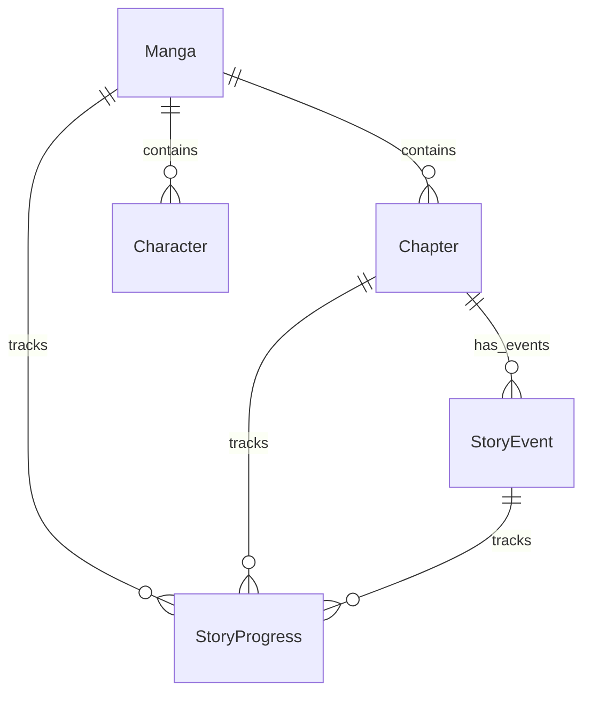

# Database Design Document
## MangaNarrator AI: Simplified PostgreSQL Schema & Prisma ORM Mapping

| Attribute | Details |
| :--- | :--- |
| **Product Name** | MangaNarrator AI |
| **Document Version** | 1.3.0 |
| **Date** | June 19, 2026 |
| **DBMS** | PostgreSQL |
| **ORM** | Prisma ORM |

---

## 1. Entity Relationship (ER) Diagram

The simplified ER diagram represents the exact layout of the MangaNarrator AI relational structure:



---

## 2. PostgreSQL DDL Schema

```sql
-- Enable UUID extension
CREATE EXTENSION IF NOT EXISTS "uuid-ossp";

-- 1. Manga Table
CREATE TABLE "Manga" (
    "id" UUID PRIMARY KEY DEFAULT uuid_generate_v4(),
    "title" VARCHAR(255) NOT NULL
);

-- 2. Chapter Table
CREATE TABLE "Chapter" (
    "id" UUID PRIMARY KEY DEFAULT uuid_generate_v4(),
    "mangaId" UUID NOT NULL REFERENCES "Manga"("id") ON DELETE CASCADE,
    "chapterNumber" INT NOT NULL,
    "title" VARCHAR(255),
    "pdfPath" TEXT NOT NULL,
    "status" VARCHAR(50) NOT NULL, -- e.g., PENDING, PROCESSING, COMPLETED, FAILED
    CONSTRAINT "uq_manga_chapter" UNIQUE ("mangaId", "chapterNumber")
);

-- 3. StoryEvent Table
CREATE TABLE "StoryEvent" (
    "id" UUID PRIMARY KEY DEFAULT uuid_generate_v4(),
    "chapterId" UUID NOT NULL REFERENCES "Chapter"("id") ON DELETE CASCADE,
    "eventOrder" INT NOT NULL,
    "title" VARCHAR(255) NOT NULL,
    "description" TEXT NOT NULL,
    CONSTRAINT "uq_chapter_event_order" UNIQUE ("chapterId", "eventOrder")
);

-- 4. Character Table
CREATE TABLE "Character" (
    "id" UUID PRIMARY KEY DEFAULT uuid_generate_v4(),
    "mangaId" UUID NOT NULL REFERENCES "Manga"("id") ON DELETE CASCADE,
    "name" VARCHAR(255) NOT NULL,
    "description" TEXT,
    CONSTRAINT "uq_manga_char_name" UNIQUE ("mangaId", "name")
);

-- 5. StoryProgress Table
CREATE TABLE "StoryProgress" (
    "id" UUID PRIMARY KEY DEFAULT uuid_generate_v4(),
    "userId" UUID NOT NULL, -- Externally mapped User representation
    "mangaId" UUID NOT NULL REFERENCES "Manga"("id") ON DELETE CASCADE,
    "chapterId" UUID NOT NULL REFERENCES "Chapter"("id") ON DELETE CASCADE,
    "eventId" UUID NOT NULL REFERENCES "StoryEvent"("id") ON DELETE CASCADE,
    CONSTRAINT "uq_user_manga_progress" UNIQUE ("userId", "mangaId")
);
```

---

## 3. Prisma Schema Definition

This section contains the exact Prisma schemas incorporating your model fields, matching relationships, and PostgreSQL datatype tags.

```prisma
datasource db {
  provider = "postgresql"
  url      = env("DATABASE_URL")
}

generator client {
  provider = "prisma-client-js"
}

model Manga {
  id            String          @id @default(uuid()) @db.Uuid
  title         String
  chapters      Chapter[]
  characters    Character[]
  progress      StoryProgress[]
}

model Chapter {
  id            String          @id @default(uuid()) @db.Uuid
  mangaId       String          @db.Uuid
  manga         Manga           @relation(fields: [mangaId], references: [id], onDelete: Cascade)
  chapterNumber Int
  title         String?
  pdfPath       String
  status        String
  events        StoryEvent[]
  progress      StoryProgress[]

  @@unique([mangaId, chapterNumber])
}

model StoryEvent {
  id          String          @id @default(uuid()) @db.Uuid
  chapterId   String          @db.Uuid
  chapter     Chapter         @relation(fields: [chapterId], references: [id], onDelete: Cascade)
  eventOrder  Int
  title       String
  description String
  progress    StoryProgress[]

  @@unique([chapterId, eventOrder])
}

model Character {
  id          String  @id @default(uuid()) @db.Uuid
  mangaId     String  @db.Uuid
  manga       Manga   @relation(fields: [mangaId], references: [id], onDelete: Cascade)
  name        String
  description String?

  @@unique([mangaId, name])
}

model StoryProgress {
  id        String     @id @default(uuid()) @db.Uuid
  userId    String     @db.Uuid
  mangaId   String     @db.Uuid
  manga     Manga      @relation(fields: [mangaId], references: [id], onDelete: Cascade)
  chapterId String     @db.Uuid
  chapter   Chapter    @relation(fields: [chapterId], references: [id], onDelete: Cascade)
  eventId   String     @db.Uuid
  event     StoryEvent @relation(fields: [eventId], references: [id], onDelete: Cascade)

  @@unique([userId, mangaId])
}
```

---

## 4. Index Recommendations & Optimizations

1. **`StoryEvent (chapterId, eventOrder)`**
   * *Type:* Composite Index (Created implicitly by `@@unique` constraint).
   * *Purpose:* Instantly loads events in sequential order for playback and question contexts.
2. **`StoryProgress (userId, mangaId)`**
   * *Type:* Composite Index (Implicit by `@@unique`).
   * *Purpose:* Retrieves or updates bookmarks during player load and narration events.
