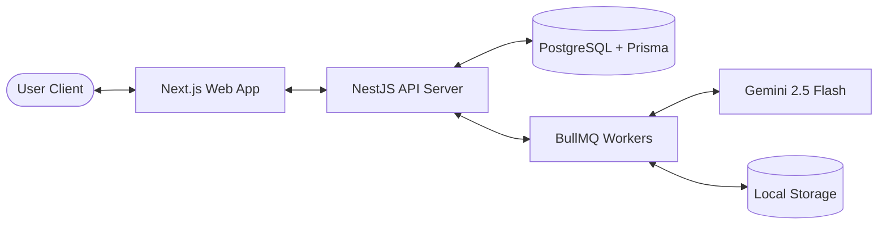
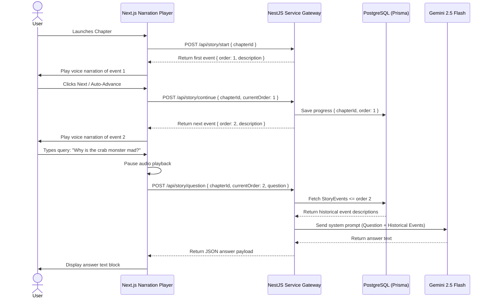

# System Design Document (SDD)
## MangaNarrator AI: Simplified High-Level Architecture & Technical Blueprint

| Attribute | Details |
| :--- | :--- |
| **Product Name** | MangaNarrator AI |
| **Document Version** | 1.2.0 |
| **Date** | June 19, 2026 |
| **Tech Stack** | Next.js (App Router), NestJS, PostgreSQL, Prisma, Gemini 2.5 Flash |

---

## 1. High-Level Architecture

MangaNarrator AI is a decoupled Web Application containing:
1. **Next.js Client App:** An interactive visual dashboard, reader page, and chat drawer.
2. **NestJS API Server:** Handles upload, page extraction, database mapping, and QA context logic.
3. **Background Job Queue:** Processes PDF conversion and Gemini extraction.
4. **PostgreSQL Database:** Stored through Prisma ORM mapping.



---

## 2. Ingestion & Story Extraction Pipeline

The pipeline transforms a PDF chapter into a simplified list of sequential events:

```
PDF Ingest (POST /manga/upload)
         ↓
PDF page-to-image extraction
         ↓
Gemini Page-Level Scan (Vision Prompt)
         ↓
Story Event Assembly (Milestone 5 JSON parser)
         ↓
Save Event & Character lists to PostgreSQL (Milestone 6)
```

### JSON Extraction Target Model (Milestone 5)
```json
{
  "chapter": 1,
  "events": [
    {
      "order": 1,
      "description": "Saitama leaves another failed job interview."
    },
    {
      "order": 2,
      "description": "A giant crab monster appears."
    }
  ]
}
```

---

## 3. Database Schema Overview
The database layer maps core records needed to track manga details, sorted events, identified characters, and reading continuation bookmarks.
*(For Prisma and SQL definitions, see [database_design.md](file:///c:/Users/DELL/OneDrive/Desktop/MangaNarrator%20Ai/docs/database_design.md)).*

---

## 4. API Endpoint Specifications

To keep the MVP minimal and robust, the API surface contains exactly five endpoints:
1. `POST /api/manga/upload` — Ingest PDF chapters.
2. `POST /api/chapter/process` — Convert PDF pages and call Gemini analysis.
3. `POST /api/story/start` — Fetch first event and set up playback layout.
4. `POST /api/story/continue` — Fetch next event index and save reading offset.
5. `POST /api/story/question` — Pause playback to answer text queries.

*(For detailed payloads and examples, see [api_design.md](file:///c:/Users/DELL/OneDrive/Desktop/MangaNarrator%20Ai/docs/api_design.md)).*

---

## 5. Playback & Interrupt QA Sequence Flow

This diagram illustrates how users listen to events, save progress, and ask context-restricted questions:



---

## 6. Question Answering Flow & Memory Context
To ensure the QA engine is context-aware without spoiling future plot points:
1. User submits a question at event order $N$.
2. Backend queries only `StoryEvent` records where `chapterId` matches and `order` is $\le N$.
3. History descriptions are compiled into a chronological text block.
4. Gemini 2.5 Flash processes the question, referencing *only* the compiled text block.
5. Future events are completely omitted from the prompt, making spoilers technically impossible.
